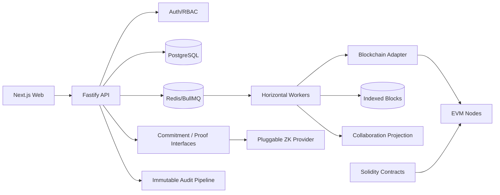

# Architecture

## Control-plane boundaries

1. API is stateless.
2. Tenant identity is derived from authenticated membership, never trusted from URL parameters.
3. Critical organization actions create governance proposals.
4. Expensive blockchain work is queued.
5. Block data is eventually indexed and projected into collaboration views.
6. Private raw data never enters blockchain storage.
7. ZK circuits are registered by `(name, version, provider)`.

## Scaling

- API replicas scale horizontally.
- BullMQ workers scale by queue.
- Indexing uses chain-local checkpoints and idempotent `(chain_id, block_number)` writes.
- PostgreSQL indexes all tenant access paths.
- Collaboration projections are materialized views, not copies of private databases.
