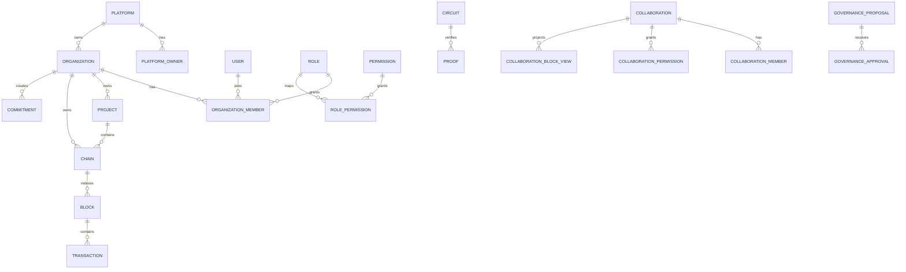

# Entity Relationships

```mermaid
erDiagram
  PLATFORM ||--o{ PLATFORM_OWNER : has
  PLATFORM ||--o{ ORGANIZATION : owns
  ORGANIZATION ||--o{ ORGANIZATION_MEMBER : has
  USER ||--o{ ORGANIZATION_MEMBER : joins
  ROLE ||--o{ ORGANIZATION_MEMBER : grants
  ROLE ||--o{ ROLE_PERMISSION : maps
  PERMISSION ||--o{ ROLE_PERMISSION : grants
  ORGANIZATION ||--o{ PROJECT : owns
  PROJECT ||--o{ CHAIN : contains
  ORGANIZATION ||--o{ CHAIN : owns
  CHAIN ||--o{ BLOCK : indexes
  BLOCK ||--o{ TRANSACTION : contains
  ORGANIZATION ||--o{ COMMITMENT : creates
  CIRCUIT ||--o{ PROOF : verifies
  COLLABORATION ||--o{ COLLABORATION_MEMBER : has
  COLLABORATION ||--o{ COLLABORATION_PERMISSION : grants
  COLLABORATION ||--o{ COLLABORATION_BLOCK_VIEW : projects
  GOVERNANCE_PROPOSAL ||--o{ GOVERNANCE_APPROVAL : receives
```
